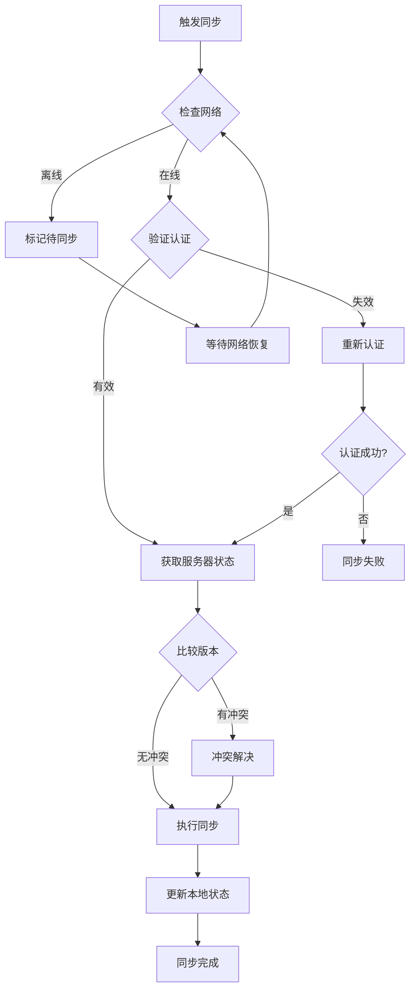

# 同步策略设计

## 1. 同步触发机制

### 1.1 自动同步触发条件
```javascript
// 同步触发时机
const SYNC_TRIGGERS = {
    // 定时同步
    PERIODIC: {
        interval: 300000, // 5分钟
        condition: 'syncSettings.autoSync === true'
    },
    
    // 数据变更触发
    DATA_CHANGE: {
        events: ['account_added', 'account_updated', 'account_deleted'],
        debounce: 5000 // 5秒防抖
    },
    
    // 扩展启动时
    EXTENSION_STARTUP: {
        condition: 'lastSyncTime > 1小时前'
    },
    
    // 网络恢复时
    NETWORK_RECOVERY: {
        condition: 'offline -> online'
    },
    
    // 手动触发
    MANUAL: {
        trigger: 'user_action'
    }
};
```

### 1.2 同步流程设计



## 2. 冲突解决策略（服务端处理）

### 2.1 服务端冲突解决原则
```javascript
// 服务端冲突解决配置
const SERVER_CONFLICT_RESOLUTION = {
    // 默认策略：时间戳优先
    DEFAULT_STRATEGY: 'newer_wins',
    
    // 冲突类型定义
    CONFLICT_TYPES: {
        VERSION_MISMATCH: 'version_conflict',     // 版本不匹配
        CONCURRENT_UPDATE: 'concurrent_conflict', // 并发修改
        DATA_INTEGRITY: 'integrity_conflict',     // 数据完整性冲突
        DUPLICATE_ACCOUNT: 'duplicate_conflict'   // 账号重复
    },
    
    // 解决策略
    RESOLUTION_STRATEGIES: {
        newer_wins: '时间戳较新的数据获胜',
        server_wins: '服务器数据优先',
        intelligent_merge: '智能合并账号数据',
        last_writer_wins: '最后写入者获胜'
    }
};
```

### 2.2 客户端简化逻辑
```javascript
class SimplifiedSyncManager {
    /**
     * 上传数据到服务端（服务端处理冲突）
     */
    async uploadDomainData(domain, data) {
        try {
            const encryptedData = await this.encryptSyncData(data);
            const dataHash = await this.calculateDataHash(data);
            
            const uploadData = {
                domainGroup: domain,
                encryptedData: encryptedData,
                clientVersion: data.syncMetadata?.version || 'v1.0.0',
                hash: dataHash,
                deviceId: await this.getDeviceId(),
                timestamp: new Date().toISOString()
            };
            
            // 直接上传，服务端处理冲突
            const response = await this.makeAuthenticatedRequest('POST', '/api/sync/data', uploadData);
            
            if (response.status === 'conflict_resolved') {
                // 服务端已解决冲突，下载最新数据
                console.log('服务端已解决冲突，获取最新数据');
                await this.downloadDomainData(domain);
            } else if (response.status === 'success') {
                // 上传成功，更新本地元数据
                await this.updateLocalSyncMetadata(domain, {
                    lastSyncTime: new Date().toISOString(),
                    serverVersion: response.data.version,
                    syncStatus: 'synced',
                    syncHash: dataHash
                });
            }
            
            console.log(`域名 ${domain} 同步完成`);
            
        } catch (error) {
            console.error(`域名 ${domain} 同步失败:`, error);
            throw error;
        }
    }
    
    /**
     * 处理服务端同步结果
     */
    async handleSyncResponse(response, domain) {
        switch (response.status) {
            case 'success':
                // 上传成功，无冲突
                await this.updateSyncSuccess(domain, response.data);
                break;
                
            case 'conflict_resolved':
                // 服务端已解决冲突，应用服务端结果
                await this.applyServerResolution(domain, response.data);
                break;
                
            case 'data_updated':
                // 数据已被其他设备更新，下载最新版本
                await this.downloadLatestData(domain);
                break;
                
            default:
                throw new Error(`未知的同步响应状态: ${response.status}`);
        }
    }
    
    /**
     * 应用服务端冲突解决结果
     */
    async applyServerResolution(domain, serverData) {
        console.log(`应用服务端冲突解决结果: ${domain}`);
        
        // 解密服务端数据
        const resolvedData = await this.decryptSyncData(serverData.encryptedData);
        
        // 保存到本地，覆盖冲突数据
        await this.saveLocalSyncData(domain, resolvedData);
        
        // 更新同步元数据
        await this.updateLocalSyncMetadata(domain, {
            lastSyncTime: new Date().toISOString(),
            serverVersion: serverData.version,
            syncStatus: 'synced',
            syncHash: serverData.hash,
            conflictResolved: true,
            resolvedAt: new Date().toISOString()
        });
        
        // 通知UI更新
        this.notifyDataUpdate(domain, 'conflict_resolved');
    }
}
```

## 3. 数据一致性保证

### 3.1 事务性同步
```javascript
class TransactionalSync {
    async performSync(operations) {
        const transaction = {
            id: this.generateTransactionId(),
            operations: operations,
            status: 'pending',
            rollback: []
        };
        
        try {
            // 阶段1: 验证所有操作
            await this.validateOperations(transaction.operations);
            
            // 阶段2: 执行操作并记录回滚信息
            for (const operation of transaction.operations) {
                const rollbackInfo = await this.executeOperation(operation);
                transaction.rollback.unshift(rollbackInfo);
            }
            
            // 阶段3: 提交事务
            transaction.status = 'committed';
            await this.commitTransaction(transaction);
            
        } catch (error) {
            // 回滚所有操作
            await this.rollbackTransaction(transaction);
            throw error;
        }
    }
}
```

### 3.2 数据校验机制
```javascript
class DataValidator {
    /**
     * 验证同步数据完整性
     */
    async validateSyncData(data) {
        const validations = [
            this.validateStructure(data),
            this.validateEncryption(data),
            this.validateTimestamps(data),
            this.validateDuplicates(data)
        ];
        
        const results = await Promise.all(validations);
        const failures = results.filter(r => !r.valid);
        
        if (failures.length > 0) {
            throw new ValidationError('数据校验失败', failures);
        }
        
        return true;
    }
    
    /**
     * 计算数据哈希值
     */
    async calculateDataHash(data) {
        // 标准化数据（排序、去除元数据）
        const normalized = this.normalizeData(data);
        const jsonString = JSON.stringify(normalized);
        return await cryptoManager.hash(jsonString);
    }
}
```

## 4. 性能优化策略

### 4.1 增量同步
```javascript
class IncrementalSync {
    /**
     * 获取增量更新数据
     */
    async getIncrementalData(lastSyncTime) {
        const changes = await storageManager.getChangesSince(lastSyncTime);
        
        return {
            additions: changes.filter(c => c.type === 'add'),
            modifications: changes.filter(c => c.type === 'modify'),
            deletions: changes.filter(c => c.type === 'delete'),
            timestamp: new Date().toISOString()
        };
    }
    
    /**
     * 应用增量更新
     */
    async applyIncrementalData(incrementalData) {
        // 按顺序应用变更：删除 -> 添加 -> 修改
        await this.processDeletions(incrementalData.deletions);
        await this.processAdditions(incrementalData.additions);
        await this.processModifications(incrementalData.modifications);
    }
}
```

### 4.2 数据压缩
```javascript
class DataCompressor {
    /**
     * 压缩同步数据
     */
    async compressData(data) {
        // 移除不必要的字段
        const cleaned = this.removeMetadata(data);
        
        // JSON压缩
        const jsonString = JSON.stringify(cleaned);
        
        // 使用gzip压缩（如果支持）
        if (typeof CompressionStream !== 'undefined') {
            return await this.gzipCompress(jsonString);
        }
        
        return jsonString;
    }
}
```

## 5. 错误处理和重试机制

### 5.1 重试策略
```javascript
class RetryManager {
    constructor() {
        this.maxRetries = 3;
        this.baseDelay = 1000; // 1秒
        this.maxDelay = 30000; // 30秒
    }
    
    /**
     * 指数退避重试
     */
    async executeWithRetry(operation, context = {}) {
        let lastError;
        
        for (let attempt = 0; attempt <= this.maxRetries; attempt++) {
            try {
                return await operation();
            } catch (error) {
                lastError = error;
                
                // 判断是否应该重试
                if (!this.shouldRetry(error, attempt)) {
                    break;
                }
                
                // 计算延迟时间
                const delay = Math.min(
                    this.baseDelay * Math.pow(2, attempt),
                    this.maxDelay
                );
                
                console.warn(`同步失败，${delay}ms后重试 (第${attempt + 1}次):`, error.message);
                await this.delay(delay);
            }
        }
        
        throw new SyncError('同步重试失败', lastError);
    }
    
    /**
     * 判断错误是否应该重试
     */
    shouldRetry(error, attempt) {
        // 超过最大重试次数
        if (attempt >= this.maxRetries) return false;
        
        // 网络错误应该重试
        if (error.name === 'NetworkError') return true;
        
        // 服务器错误（5xx）应该重试
        if (error.status >= 500 && error.status < 600) return true;
        
        // 认证错误不重试
        if (error.status === 401 || error.status === 403) return false;
        
        // 其他客户端错误不重试
        if (error.status >= 400 && error.status < 500) return false;
        
        return true;
    }
}
```

## 6. 同步状态管理

### 6.1 状态机设计
```javascript
const SYNC_STATES = {
    IDLE: 'idle',
    SYNCING: 'syncing', 
    CONFLICT: 'conflict',
    ERROR: 'error',
    OFFLINE: 'offline'
};

const SYNC_EVENTS = {
    START_SYNC: 'start_sync',
    SYNC_SUCCESS: 'sync_success',
    SYNC_ERROR: 'sync_error',
    CONFLICT_DETECTED: 'conflict_detected',
    CONFLICT_RESOLVED: 'conflict_resolved',
    NETWORK_OFFLINE: 'network_offline',
    NETWORK_ONLINE: 'network_online'
};

class SyncStateMachine {
    constructor() {
        this.state = SYNC_STATES.IDLE;
        this.transitions = {
            [SYNC_STATES.IDLE]: {
                [SYNC_EVENTS.START_SYNC]: SYNC_STATES.SYNCING,
                [SYNC_EVENTS.NETWORK_OFFLINE]: SYNC_STATES.OFFLINE
            },
            [SYNC_STATES.SYNCING]: {
                [SYNC_EVENTS.SYNC_SUCCESS]: SYNC_STATES.IDLE,
                [SYNC_EVENTS.SYNC_ERROR]: SYNC_STATES.ERROR,
                [SYNC_EVENTS.CONFLICT_DETECTED]: SYNC_STATES.CONFLICT,
                [SYNC_EVENTS.NETWORK_OFFLINE]: SYNC_STATES.OFFLINE
            },
            [SYNC_STATES.CONFLICT]: {
                [SYNC_EVENTS.CONFLICT_RESOLVED]: SYNC_STATES.SYNCING,
                [SYNC_EVENTS.SYNC_ERROR]: SYNC_STATES.ERROR
            },
            [SYNC_STATES.ERROR]: {
                [SYNC_EVENTS.START_SYNC]: SYNC_STATES.SYNCING,
                [SYNC_EVENTS.NETWORK_OFFLINE]: SYNC_STATES.OFFLINE
            },
            [SYNC_STATES.OFFLINE]: {
                [SYNC_EVENTS.NETWORK_ONLINE]: SYNC_STATES.IDLE
            }
        };
    }
}
``` 