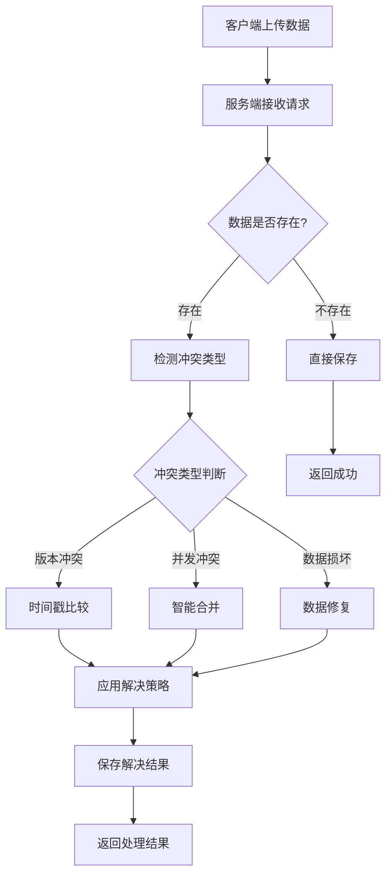

# 服务端冲突处理方案

## 🎯 设计原则

### 核心理念
- **服务端为真理的唯一来源**：所有冲突由服务端统一处理
- **客户端简化逻辑**：客户端只负责上传和应用结果
- **数据一致性保证**：确保所有设备最终数据一致
- **透明化处理**：冲突处理对用户尽可能透明

## 🏗️ 服务端冲突处理架构

### 1. 冲突检测流程


### 2. 冲突类型定义
```javascript
const CONFLICT_TYPES = {
    // 版本冲突：客户端版本与服务端版本不匹配
    VERSION_CONFLICT: {
        code: 'VERSION_CONFLICT',
        description: '数据版本不匹配',
        resolution_strategy: 'timestamp_comparison'
    },
    
    // 并发冲突：多设备同时修改相同数据
    CONCURRENT_CONFLICT: {
        code: 'CONCURRENT_CONFLICT', 
        description: '并发修改冲突',
        resolution_strategy: 'intelligent_merge'
    },
    
    // 完整性冲突：数据哈希验证失败
    INTEGRITY_CONFLICT: {
        code: 'INTEGRITY_CONFLICT',
        description: '数据完整性冲突',
        resolution_strategy: 'data_validation'
    },
    
    // 账号重复：相同域名下用户名冲突
    DUPLICATE_CONFLICT: {
        code: 'DUPLICATE_CONFLICT',
        description: '账号重复冲突',
        resolution_strategy: 'account_merge'
    }
};
```

## 🔧 服务端API实现

### 1. 数据上传接口（带冲突处理）
```javascript
// POST /api/sync/data
app.post('/api/sync/data', authenticateToken, async (req, res) => {
    const transaction = await db.beginTransaction();
    
    try {
        const { domainGroup, encryptedData, clientVersion, hash, deviceId, timestamp } = req.body;
        const userId = req.user.id;
        
        // 1. 数据验证
        const validationResult = await validateSyncData(req.body);
        if (!validationResult.valid) {
            return res.status(400).json({
                status: 'error',
                error: 'VALIDATION_FAILED',
                details: validationResult.errors
            });
        }
        
        // 2. 获取现有数据
        const existingData = await SyncData.findOne({
            userId,
            domainGroup
        }, { transaction });
        
        if (!existingData) {
            // 2.1 首次上传，直接保存
            const newData = await createSyncData({
                userId,
                domainGroup,
                encryptedData,
                version: generateVersion(),
                dataHash: hash,
                createdByDevice: deviceId,
                updatedByDevice: deviceId
            }, transaction);
            
            await transaction.commit();
            
            return res.json({
                status: 'success',
                data: {
                    version: newData.version,
                    hash: newData.dataHash,
                    timestamp: newData.updatedAt
                }
            });
        }
        
        // 3. 冲突检测
        const conflictResult = await detectConflict(existingData, {
            clientVersion,
            hash,
            timestamp,
            deviceId
        });
        
        if (conflictResult.hasConflict) {
            // 4. 冲突解决
            const resolution = await resolveConflict(
                existingData,
                { encryptedData, clientVersion, hash, timestamp, deviceId },
                conflictResult.conflictType
            );
            
            // 5. 保存解决结果
            await updateSyncData(existingData.id, {
                encryptedData: resolution.resolvedData,
                version: generateVersion(),
                dataHash: resolution.resolvedHash,
                updatedByDevice: deviceId,
                conflictResolution: {
                    type: conflictResult.conflictType,
                    strategy: resolution.strategy,
                    resolvedAt: new Date(),
                    details: resolution.details
                }
            }, transaction);
            
            await transaction.commit();
            
            return res.json({
                status: 'conflict_resolved',
                data: {
                    encryptedData: resolution.resolvedData,
                    version: resolution.version,
                    hash: resolution.resolvedHash,
                    resolutionDetails: {
                        conflictType: conflictResult.conflictType,
                        strategy: resolution.strategy,
                        resolvedAt: new Date()
                    }
                }
            });
        } else {
            // 6. 无冲突，正常更新
            await updateSyncData(existingData.id, {
                encryptedData,
                version: generateVersion(),
                dataHash: hash,
                updatedByDevice: deviceId
            }, transaction);
            
            await transaction.commit();
            
            return res.json({
                status: 'success',
                data: {
                    version: existingData.version,
                    hash: hash,
                    timestamp: new Date()
                }
            });
        }
        
    } catch (error) {
        await transaction.rollback();
        console.error('同步数据处理失败:', error);
        
        return res.status(500).json({
            status: 'error',
            error: 'SYNC_FAILED',
            message: '数据同步处理失败'
        });
    }
});
```

### 2. 冲突检测算法
```javascript
/**
 * 检测数据冲突
 * @param {Object} existingData - 服务端现有数据
 * @param {Object} clientData - 客户端上传数据
 * @returns {Object} 冲突检测结果
 */
async function detectConflict(existingData, clientData) {
    const result = {
        hasConflict: false,
        conflictType: null,
        details: {}
    };
    
    // 1. 哈希值比较
    if (existingData.dataHash === clientData.hash) {
        // 数据相同，无冲突
        return result;
    }
    
    // 2. 版本比较
    const serverTime = new Date(existingData.updatedAt);
    const clientTime = new Date(clientData.timestamp);
    const timeDiff = Math.abs(serverTime - clientTime);
    
    // 3. 设备检查
    const sameDevice = existingData.updatedByDevice === clientData.deviceId;
    
    // 4. 冲突类型判断
    if (existingData.version !== clientData.clientVersion) {
        result.hasConflict = true;
        result.conflictType = CONFLICT_TYPES.VERSION_CONFLICT.code;
        result.details = {
            serverVersion: existingData.version,
            clientVersion: clientData.clientVersion,
            timeDiff: timeDiff
        };
    } else if (timeDiff < 60000 && !sameDevice) {
        // 1分钟内不同设备修改，认为是并发冲突
        result.hasConflict = true;
        result.conflictType = CONFLICT_TYPES.CONCURRENT_CONFLICT.code;
        result.details = {
            serverDevice: existingData.updatedByDevice,
            clientDevice: clientData.deviceId,
            timeDiff: timeDiff
        };
    } else {
        // 其他情况，认为是正常的数据更新
        result.hasConflict = true;
        result.conflictType = CONFLICT_TYPES.VERSION_CONFLICT.code;
        result.details = {
            timeDiff: timeDiff,
            sameDevice: sameDevice
        };
    }
    
    return result;
}
```

### 3. 冲突解决策略
```javascript
/**
 * 解决数据冲突
 * @param {Object} serverData - 服务器数据
 * @param {Object} clientData - 客户端数据 
 * @param {string} conflictType - 冲突类型
 * @returns {Object} 解决结果
 */
async function resolveConflict(serverData, clientData, conflictType) {
    const config = await getConflictResolutionConfig();
    
    switch (conflictType) {
        case CONFLICT_TYPES.VERSION_CONFLICT.code:
            return await resolveVersionConflict(serverData, clientData, config);
            
        case CONFLICT_TYPES.CONCURRENT_CONFLICT.code:
            return await resolveConcurrentConflict(serverData, clientData, config);
            
        case CONFLICT_TYPES.DUPLICATE_CONFLICT.code:
            return await resolveDuplicateConflict(serverData, clientData, config);
            
        default:
            return await resolveDefaultConflict(serverData, clientData, config);
    }
}

/**
 * 解决版本冲突（时间戳优先）
 */
async function resolveVersionConflict(serverData, clientData, config) {
    const serverTime = new Date(serverData.updatedAt);
    const clientTime = new Date(clientData.timestamp);
    
    if (clientTime > serverTime) {
        // 客户端数据更新，使用客户端数据
        return {
            resolvedData: clientData.encryptedData,
            resolvedHash: clientData.hash,
            version: generateVersion(),
            strategy: 'client_wins_by_timestamp',
            details: {
                reason: '客户端时间戳更新',
                serverTime: serverTime,
                clientTime: clientTime
            }
        };
    } else {
        // 服务器数据更新，保持服务器数据
        return {
            resolvedData: serverData.encryptedData,
            resolvedHash: serverData.dataHash,
            version: serverData.version,
            strategy: 'server_wins_by_timestamp',
            details: {
                reason: '服务器时间戳更新',
                serverTime: serverTime,
                clientTime: clientTime
            }
        };
    }
}

/**
 * 解决并发冲突（智能合并）
 */
async function resolveConcurrentConflict(serverData, clientData, config) {
    try {
        // 解密两份数据
        const serverDecrypted = await decryptServerData(serverData.encryptedData);
        const clientDecrypted = await decryptServerData(clientData.encryptedData);
        
        // 智能合并账号数据
        const mergedData = await mergeAccountData(serverDecrypted, clientDecrypted);
        
        // 重新加密
        const mergedEncrypted = await encryptServerData(mergedData);
        const mergedHash = calculateHash(mergedEncrypted);
        
        return {
            resolvedData: mergedEncrypted,
            resolvedHash: mergedHash,
            version: generateVersion(),
            strategy: 'intelligent_merge',
            details: {
                reason: '智能合并并发修改',
                serverAccounts: serverDecrypted.accounts?.length || 0,
                clientAccounts: clientDecrypted.accounts?.length || 0,
                mergedAccounts: mergedData.accounts?.length || 0
            }
        };
        
    } catch (error) {
        console.error('智能合并失败，回退到时间戳策略:', error);
        return await resolveVersionConflict(serverData, clientData, config);
    }
}

/**
 * 智能合并账号数据
 */
async function mergeAccountData(serverData, clientData) {
    const merged = {
        groupKey: serverData.groupKey || clientData.groupKey,
        baseDomain: serverData.baseDomain || clientData.baseDomain,
        appPackages: [...new Set([
            ...(serverData.appPackages || []),
            ...(clientData.appPackages || [])
        ])],
        accounts: []
    };
    
    // 创建账号映射
    const accountMap = new Map();
    
    // 添加服务器账号
    (serverData.accounts || []).forEach(account => {
        const key = `${account.username}@${account.subDomain || account.appPackage || 'default'}`;
        accountMap.set(key, {
            ...account,
            source: 'server',
            serverTime: new Date(account.modifyTime)
        });
    });
    
    // 合并客户端账号
    (clientData.accounts || []).forEach(account => {
        const key = `${account.username}@${account.subDomain || account.appPackage || 'default'}`;
        const existing = accountMap.get(key);
        
        if (existing) {
            // 账号冲突，选择较新的
            const clientTime = new Date(account.modifyTime);
            if (clientTime >= existing.serverTime) {
                accountMap.set(key, {
                    ...account,
                    source: 'client_newer',
                    mergedAt: new Date()
                });
            }
            // 否则保持服务器版本
        } else {
            // 新账号，直接添加
            accountMap.set(key, {
                ...account,
                source: 'client_new',
                mergedAt: new Date()
            });
        }
    });
    
    // 转换为数组
    merged.accounts = Array.from(accountMap.values()).map(account => {
        // 清理合并元数据
        const { source, serverTime, mergedAt, ...cleanAccount } = account;
        return cleanAccount;
    });
    
    return merged;
}
```

## 📊 冲突解决配置

### 1. 全局配置
```javascript
const CONFLICT_RESOLUTION_CONFIG = {
    // 默认策略
    default_strategy: 'newer_wins',
    
    // 策略配置
    strategies: {
        newer_wins: {
            description: '时间戳较新的数据获胜',
            priority: 1
        },
        intelligent_merge: {
            description: '智能合并不冲突的数据',
            priority: 2,
            enabled: true,
            fallback: 'newer_wins'
        },
        server_wins: {
            description: '服务器数据优先',
            priority: 3
        },
        last_writer_wins: {
            description: '最后写入者获胜',
            priority: 4
        }
    },
    
    // 冲突阈值
    thresholds: {
        concurrent_time_window: 60000,  // 并发冲突时间窗口（毫秒）
        max_merge_accounts: 1000,       // 最大合并账号数
        version_tolerance: 5            // 版本容差
    }
};
```

### 2. 用户自定义策略
```javascript
// 允许用户配置冲突解决偏好
const USER_CONFLICT_PREFERENCES = {
    userId: 'user-uuid',
    preferences: {
        default_strategy: 'intelligent_merge',
        allow_data_loss: false,          // 是否允许数据丢失
        prefer_local_changes: true,      // 是否偏好本地修改
        auto_resolve_duplicates: true,   // 自动解决重复账号
        merge_timeout_ms: 30000         // 合并超时时间
    },
    domain_specific: {
        'sensitive-domain.com': {
            strategy: 'manual_review',   // 敏感域名需要手动审核
            require_confirmation: true
        }
    }
};
```

## 🔍 监控和日志

### 1. 冲突统计
```javascript
// 冲突统计数据结构
const CONFLICT_METRICS = {
    daily_conflicts: {
        date: '2025-01-01',
        total_conflicts: 150,
        by_type: {
            version_conflict: 80,
            concurrent_conflict: 50,
            duplicate_conflict: 20
        },
        by_strategy: {
            newer_wins: 90,
            intelligent_merge: 45,
            server_wins: 15
        },
        resolution_success_rate: 0.95
    },
    
    user_conflict_frequency: {
        high_conflict_users: ['user1', 'user2'],
        average_conflicts_per_user: 2.3,
        max_conflicts_single_user: 15
    }
};
```

### 2. 冲突审计日志
```javascript
// 冲突解决审计记录
const CONFLICT_AUDIT_LOG = {
    id: 'audit-uuid',
    userId: 'user-uuid',
    domainGroup: 'example.com',
    conflictType: 'CONCURRENT_CONFLICT',
    detectedAt: '2025-01-01T12:00:00Z',
    resolvedAt: '2025-01-01T12:00:05Z',
    resolution: {
        strategy: 'intelligent_merge',
        dataChanges: {
            accounts_added: 2,
            accounts_modified: 1,
            accounts_removed: 0
        },
        confidence_score: 0.85
    },
    devices_involved: ['device1', 'device2'],
    data_hash_before: 'hash1',
    data_hash_after: 'hash2'
};
```

## 🚀 性能优化

### 1. 冲突检测优化
```javascript
// 使用Redis缓存减少数据库查询
class ConflictDetectionCache {
    constructor() {
        this.redis = new Redis(config.redis);
        this.cache_ttl = 300; // 5分钟缓存
    }
    
    async getCachedData(userId, domainGroup) {
        const key = `sync:${userId}:${domainGroup}`;
        const cached = await this.redis.get(key);
        return cached ? JSON.parse(cached) : null;
    }
    
    async setCachedData(userId, domainGroup, data) {
        const key = `sync:${userId}:${domainGroup}`;
        await this.redis.setex(key, this.cache_ttl, JSON.stringify(data));
    }
}
```

### 2. 批量冲突处理
```javascript
// 批量处理多个域名的冲突
app.post('/api/sync/batch', authenticateToken, async (req, res) => {
    const { domains } = req.body;
    const results = [];
    
    // 并发处理多个域名
    const promises = domains.map(async (domainData) => {
        try {
            const result = await processSingleDomain(domainData, req.user.id);
            return { domain: domainData.domainGroup, ...result };
        } catch (error) {
            return { 
                domain: domainData.domainGroup, 
                status: 'error', 
                error: error.message 
            };
        }
    });
    
    const batchResults = await Promise.allSettled(promises);
    
    res.json({
        status: 'batch_completed',
        results: batchResults.map(r => r.value || { status: 'error', error: r.reason })
    });
});
```

这个服务端冲突处理方案确保了：

1. **统一的冲突解决策略**：所有客户端遵循相同的规则
2. **智能的数据合并**：自动处理大部分冲突场景
3. **完整的审计追踪**：记录所有冲突和解决过程
4. **高性能处理**：优化的算法和缓存机制
5. **灵活的配置**：支持用户自定义和域名特定策略

客户端只需要简单地上传数据并应用服务端的决策，大大简化了实现复杂度。 